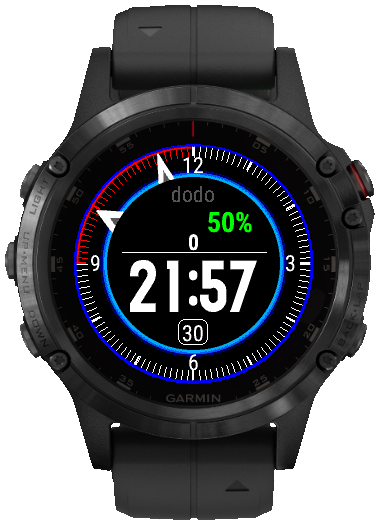

# dodoGarminWatchFace
Analog/Digital watch face for round Garmin watches. To build the watchface you need Garmin Connect IQ SDK and Eclipse with Garmin plugins.

Inspiration by Honda Civic 8G dashboard

## Preview

#

* [GNU GPLv3](https://www.gnu.org/licenses/gpl-3.0.txt) 

Code inspiration:

https://github.com/elp87/elp87GarminWatchFace

https://github.com/OliverHannover/Formula_1

https://github.com/lievsim/swissMilitaryGarminWatchFace
